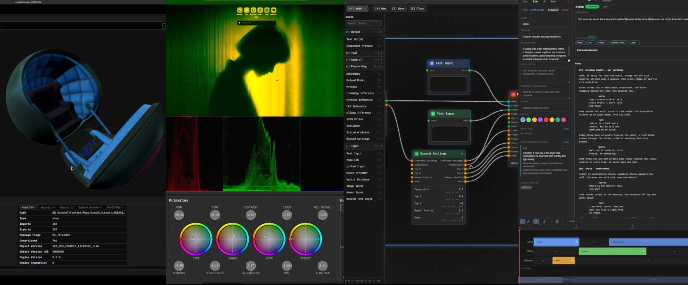

## AI-First Creative Tools for Film & Games

Building cross-platform desktop apps that put AI at the core of 2D, 3D, and creative writing workflows.

Rust Python backends | Game engine + web frontends | P2P networking

---

## Featured Projects

| Project                                                     | Description                                                                           |
| ----------------------------------------------------------- | ------------------------------------------------------------------------------------- |
| [Eidetic](https://github.com/MrScripty/Eidetic)             | Clip-based AI screenwriting tool for film                                             |
| [Pantograph](https://github.com/MrScripty/Pantograph)       | Embedded AI workflow engine                                      |
| [Pumas Library](https://github.com/MrScripty/Pumas-Library) | Embedded local models made easy      |
| [Pentimento](https://github.com/MrScripty/Pentimento)       | 3D sculpting & model gen, 3D Depth Map generation Projection Painting with diffusion. |
| [Korino](https://github.com/MrScripty/Korino-Reaves)        | The only open reverse engineered UE4/5 modding tool with 3D scene viewing             |
| Angrd                                                       | A yet to be revealed Davinci Resolve plugin for folly design                          |

Many repos are exploritory stand-alone feature demos for modules developed for Studio Whip, a real-time collaborative AI produciton environment for film.

---

<!-- GH_STATS_START -->

 
 
<!-- GH_STATS_END -->

