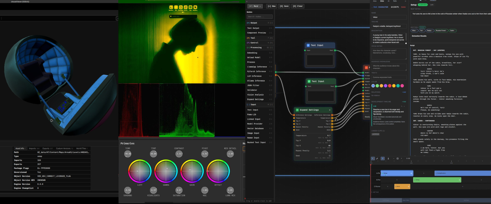

# Agent-First Systems, Graphs & Creative Tools

I develop independent, reusable projects that can support many applications. Some began as experiments, and many contain areas of active research. Practical applications give that research real problems to solve and ways to test the results. Ideas can move between projects without becoming runtime dependencies.

## Models, workflows & agent-first development

| Project | Purpose & current direction |
| --- | --- |
| [Pumas Library](https://github.com/MrScripty/Pumas-Library) | Model files, metadata, downloads, and runtime configuration in a reusable Rust backend with an optional desktop interface. Practical local inference is an immediate priority; its plugins are a staging ground for heterogeneous backends under a unified API, including llama.cpp, Ollama, ONNX, and Torch. |
| [Passeur](https://github.com/MrScripty/Passeur) | Cross-provider coding-agent delegation with affordable model use, durable tasks, and repository-level coordination. Ongoing research addresses early detection and resolution of overlapping edits, with less intervention and fewer conflicts at final integration, toward longer-term large-scale parallel software production. |
| Chrema · private | Workflow composition and auditable ledgers for deterministic operations and probabilistic model outputs. A practical setting for developing alternative data-flow composition and tracing, with lessons that may inform Pantograph. |
| [Coding-Standards](https://github.com/MrScripty/Coding-Standards) | Reusable engineering standards and a node/information-graph engine with agent-first interfaces for finding relevant knowledge, understanding relationships, and making evidence-backed changes. It's essential to how I build and a real application for refining those abstractions. |
| [Pantograph](https://github.com/MrScripty/Pantograph) | Rust-native node-based AI workflows, execution, and resource management. Scheduling addresses the mathematical problem of running work under resource constraints; distribution across machines is a future direction. |
| [Whip Docs](https://github.com/MrScripty/whip-docs) | A local code-architecture explorer for Rust repositories. I'm developing it toward intent-provenance software development: visual code graphs connected to the intent, reasoning, and standards behind decisions, understandable at a glance. |
| [Eidetic](https://github.com/MrScripty/Eidetic) | A writing workspace connecting stories and their relationships through knowledge graphs, with screenwriting as one use case. It also supports research into memory and knowledge structures for Chrema and Nearwork. |

## Creative tools & applications

| Project | Purpose & current direction |
| --- | --- |
| [Pentimento](https://github.com/MrScripty/Pentimento) | A Bevy-based rendering workspace with web and native frontends, providing a practical setting for hybrid-interface development. |
| [Crispen](https://github.com/MrScripty/Crispen) | Reusable color-grading modules and the tools around them. |
| [Korino](https://github.com/MrScripty/Korino-Reaves) | A reverse-engineered UE4/5 asset-inspection and modding workbench with 3D scene viewing. |
| [Tuldok](https://github.com/MrScripty/Tuldok) | The beginning of a model-training system, currently focused on dataset capture, labeling, generation, and export. One goal is training tiny models that can run on phones for Book-Be-Gone. |
| [Book-Be-Gone](https://github.com/MrScripty/Book-Be-Gone) | A commercial book-digitization product I'm developing, turning captured pages into editable text. Its planned phone application gives the small-model training work a practical target. |
| Nearwork · private | A commercial location-based evidence and research application. Its real-world information needs also guide research into data modeling. |

## Books & research

I write about the methods behind this work, from training models and producing datasets to making engineering decisions from evidence.

| Book | Focus |
| --- | --- |
| [Training Your Own Models on One 24 GB GPU](https://bc-ai-ecosystem.github.io/training-your-own-models/) | A project-first handbook spanning language, vision, embeddings, and other model families, with interactive learning tools. Vibe Authored by Dr.Puma; I transferred the project to BC+AI. |
| [Practical Data Analysis for Engineering Decisions](https://mrscripty.github.io/practical-data-analysis/) | Measurement, fair comparisons, uncertainty, and turning analysis into engineering decisions, with nine interactive examples and a reproducible companion. |
| [Dataset Production](https://mrscripty.github.io/dataset-production/) | A methods-first fieldbook on building, reviewing, and releasing datasets, with educational examples covering labels, splits, synthetic data, and provenance. |

My other books include *Cooking the Cat*, *Contribution Belonging and Shared Power*, and *Knowledge Graphs and Agentic Memory*.

The [Pantograph research collection](https://github.com/MrScripty/Pantograph/blob/b09380618224277e21fc5be2a2fe7ccc21e9d7dd/docs/research/README.md) brings together a book and papers on compatible inference backends, node execution, provenance, and resource-safe scheduling, plus a scheduler simulation report. These research editions document evidence and proposals that inform development.

## Longer-term direction

[Studio Whip](https://github.com/MrScripty/Studio-Whip) was the original starting point: a collaborative creative-production application for film and other visual storytelling. It remains a longer-term goal, with substantial foundational work and integration still ahead. The same foundations are intended for additional applications beyond the projects outlined here.

These projects are at different stages. Their repositories document current capabilities and work in progress; the connections here explain how practical tools and research inform each other.

---

<!-- GH_STATS_START -->

 
 
<!-- GH_STATS_END -->

